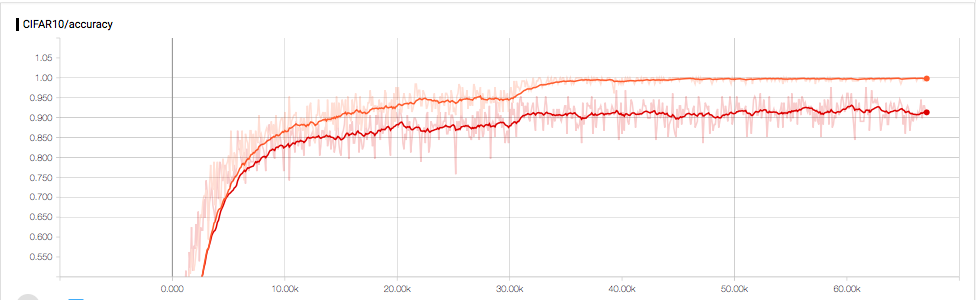

# ResNet Tensorflow on CIFAR10

This repository provides implementation to reproduce the result from the paper [Deep Residual Learning 
for Image Recognition](https://arxiv.org/abs/1512.03385) on CIFAR10 in
Tensorflow.
The network in this paper is refered as ResNet v1, where different 
architectures such as ResNet v2,  wide ResNet are left as future work.

Note all papers, the network used for ImageNet and CIFAR10 are different.
Basically, the network used for CIFAR10 has less number of channels. If one
naively train the network for ImageNet on CIFAR10 dataset, the result can not
reach the expected value as in the paper due to overfitting.

 

### Requirements
Tensorflow

### Results

Train:45000, Val:5000   
ResNet56 (2+54) bottleneck channels = [16-32-64], reg 0.0001   
Accuracy: 91.8%  

Train:50000, Val:10000   
ResNet29 (2+27) bottleneck channels = [16-32-64], reg 0.0001
Accuracy: 89% 
ResNet29 (2+27) bottleneck channels = [16-32-64], reg 0.0003   
Accuracy: 91.04%  
ResNet29 (2+27) bottleneck channels = [64-128-256], reg 0.0005   
Accuracy: 94.0%

### Links
ResNetv1 50layers Visualization [here](http://ethereon.github.io/netscope/#/gist/db945b393d40bfa26006)     
ResNetv2 [Identity Mappings in Deep Residual Networks](https://arxiv.org/pdf/1603.05027.pdf)    
Wide Residual Network  [here](https://arxiv.org/pdf/1605.07146.pdf)       
[Wider or Deeper: Revisiting the ResNet Model for Visual
Recognition](https://arxiv.org/abs/1611.10080)    
ResNeXt [Aggregated Residual Transformations for Deep Neural Networks](https://arxiv.org/pdf/1611.05431.pdf)

### To do list

- [ ] Tensorized ResNet
- [ ] Remove unnecessary VGG related code
- [ ] Separate numpy save to utils
- [ ] Rename slim model so one can restore and fine tune.
- [ ] ResNet version2 as in arXiv:1603.05027
- [ ] 
